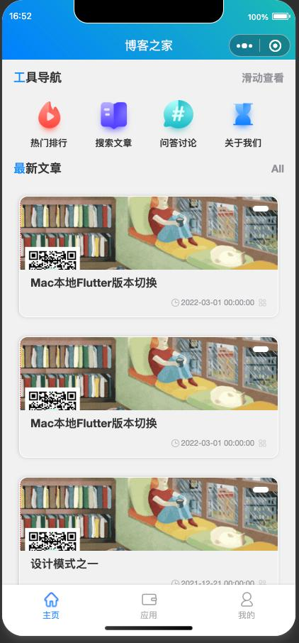
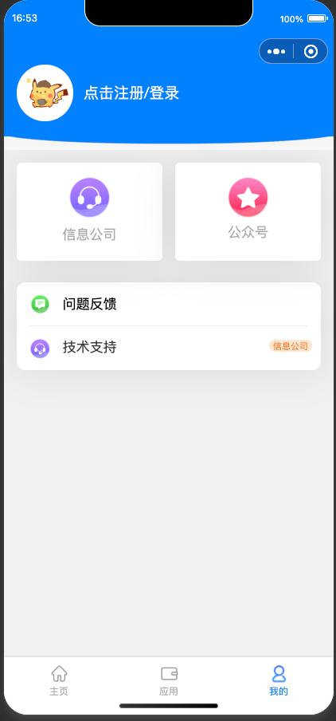

<p align="center">
    
</p>

<p align="center">
	<a href="https://blog.rdtalk.cn" target="_blank">
		
	</a>
	
</p>

<h1 align="center">《Rdtalk 博客分享》· 开源，易上手~ </h1>

<div align="center">

<p>无博客后端，博客数据来源与 hexo 与github 搭建的博客系统</p>
<p>基于uni-app、colorUi、uView，支持小程序、H5、Android和IOS</p>

```
🕙 项目基本保持更新，右上随手点个 🌟 Star 关注，这样才有持续下去的动力，谢谢～
```

</div>

</br></br>
### 扫码体验


### 文档地址
[点击查看详细说明文档，一定要仔细看哦～](http://blog.rdtalk.cn/)

### 项目说明

1.  项目基于Vue-uniApp，使用colorUi与uview框架，部分Demo参考uniApp插件市场等，感谢各位作者～
2.  项目计划功能 (部分)：
 
- [x] 自定义TabBar与顶部
- [x] 博客查询
- [x] 渐变动画
- [x] 加载动画
- [x] 会员中心
- [x] 授权登录
- [x] 自定义键盘
- [x] 行政区域图
- [ ] 海报生成器
- [ ] 海报设计工具
- [ ] 数据封装请求

3.  组件模版是为了大家做需求时方便查阅参考，万一哪天公司的产品给你提出来了～
4.  其他功能还在补充中，部分接口已删除，如果有其他需求也可以留言给我～
5.  开源的目的就是为了方便同行的小伙伴，还请各位多支持～ 
6.  本人自知技术还处于底层，还是有很多需要学习的地方！


### 部分截图



### 目录说明
```                
├─colorui        		// colorui插件依赖
├─common              	// 项目相关公共方法
│	├─css		// 项目公共css
├─components          	// 项目中使用到的功能封装
├─pages      			// 页面入口文件夹
│	├─auth				// 用户授权
│	├─basic				// 其他功能
│	├─blog				// 博客部分
│	├─home			// 博客主页
│	├─index			// 主要入口
├─static            	// 静态资源
├─App.vue				// vue项目入口文件
├─LICENSE				// 许可证
├─main.js				// 公共js
├─manifest.json			// uniapp项目配置文件
├─pages.json			// 页面路由配置页
├─README.md				// 说明文档
└─uni.scss				// uniapp内置的常用样式变量

```

### 安装教程

1.  下载安装：「HBuildX」、「微信开发者工具」
2.  扫码登陆微信开发者工具
3.  将项目拖进【HBuildX】- 运行 - 微信小程序 - 完成


### 作者信息

1.  作者：乐子 (Allan)
2.  邮箱：yingle1991@163.com
3.  公众号：乐子侃生活
4.  博客：blog.rdtalk.cn


### 其他说明
> *  查看最新项目，请使用微信搜索小程序：“Fix乐子工具箱”
> *  如果有不错的页面功能、设计，大家都可以参与项目开发
> *  博客地址 首页 [qdpz.zhoukaiwen.com](https://qdpz.zhoukaiwen.com)

### 关于后台
> *  目前使用 `「Rdtalk」` 制作的后台，感谢作者开源！
> * 已完成板块：博客文章、开源项目管理等，并且在持续制作中... 请关注项目。

### 「Rdtalk」交流群


### 赞助作者
> *  打赏就duck不必啦～ 就点点🌟 Star 🌟 关注更新，支持下作者就可以了

### 有项目、设计、其他方面需求合作，可以联系微信：
> *  183767076（请备注：合作/需求/设计/等）